# Warsztat Kubernetes 0 do 1
Michał Kurzeja <michal@accesto.com>, Accesto 


## Do przygotowania przed warsztatem

Mamy jedynie 5 godzin na cały warsztat, a chciałbym zmieścić jak najwięcej konkretów. 
W związku z tym proszę Cię o przygotowanie poniższych rzeczy PRZED warsztatem. Pozwoli to na efektywne wykorzystanie czasu.

Najlepiej będzię się pracowało na systemie Linux lub MacOS. Z Windows nie mam praktycznie żadnego doświadczenia i nie będę też w stanie zbyt wiele pomóc, jeśli coś pójdzie nie tak.
Niestety warsztat nie zadziała na Linuxie odpalonym wewnątrz maszyny wirtualnej (VirtualBox etc).

**Teraz już wiem, że to się nie stanie, bo wiadmoś ta nie poszła dalej do Was. Bez obaw, damy radę! Na Windows myślę, że też, ale na wszelki wypadek dobierzmy się w jakieś pary "awaryjne".**


Programy do wgrania:
* kubectl - lokalnie, jest to narzędzie do zarządzania klastrem Kubernetes
* minikube - lokalnie, pozwala na postawienie mini klastra Kubernetes. Alternatyw jest wiele. Możesz też uruchomić sobie mały klaster w cloud, np. Google Cloud, DigitalOcean.
  * virtualbox - jest wymagany przez minikube

Wiedza:
* podstawy Dockera - Kubernetes działa w oparciu o kontenery, podstawy będą bardzo przydatne.
* terminal - będziemy mocno korzystać z aplikacji CLI, wystarczą podstawy


## Rozgrzewka

*tajemnica :D*

## Cel warsztatu

Po tym warsztacie będziesz w stanie uruchomić aplikację w Kubernetes, aktualizować ją i debugować.

## Droga do celu - Agenda

1. Zasady
2. Podstawy Kubernetesa
3. Minikube i setup środowiska
4. *Przerwa*
5. Pod
6. ReplicaSet
7. Service
8. Ingress
9. Deployment
10. CronJobs
11. ConfigMap
12. Namespace
13. SSL
14. Helm
15. PersistentVolume i PersistentVolumeClaim
16. Uruchamianie Mautic, Sylius, Własnego projektu?

## Zasady

1. Skup się na warsztacie - telefony etc. na bok. Wyłącz Slacka i powiadomienia na komputerze. Niech Twoje rozkojarzenie nie blokuje grupy ;)
2. Jeśli coś jest niejasne, są pytania lub komentarze - daj znać od razu.
3. Pracujemy grupowo ;)

## Czym jest Kubernetes

> Kubernetes (K8s) is an open-source system for automating deployment, scaling, and management of containerized applications.

Dla mnie k8s jest narzędziem które pozwala mi, jako programiście, łatwo zarządzać aplikacjami uruchamianymi w chmurze, bez potrzeby szerokiej znajomości tematów administracyjnych.
Znacznie ułatwia mi pracę, a jednocześnie pozwala oferować większą wartość dla klientów.

### Co oferuje k8s

* Automatyczne rollouty i rollbacki
* Skalowanie horyzontalne
* Service discovery i load balancing
* Zarządzanie wolumenami danych (storage)
* Łatwe zarządzanie dużą liczbą zadań
* Automatyczne rozkładanie obciążenia (tzw. upychanie na maszyny ;))
* Self-healing - mechanizmy zapewniające automatyczne przywracanie usług "do życia"
* Zarządzanie konfiguracją i danym poufnymi

### Dlaczego akurat k8s?

* Oparty o 15 lat doświadczenia Google
* Standard w branży, wsparcie praktycznie każdego znaczącego providera chmurowego, wsparcie dla dowolnych maszyn
   * Google Cloud
   * Microsoft Azure
   * Amazon AWS
   * IBM Bluemix
   * Digital Ocean
   * OVH
   * ...
* Ogromna społeczność
* Szeroki wachlarz oficjalnych rozwiązań 

### Ciekawe projekty

* k3s
* minikube
* FaaS
  * Kubeless
  * Fission
  * OpenFaas
  * OpenWhisk
  * ....
* service mesh
* i więcej...

Po prostu społeczność jest ogromna ;)
    
### Minikube

Postanowiłem oprzeć warsztat o minikube, ponieważ pozwala w bardzo szybkim czasie postawić Kubernetes na swoim laptopie, pozwala też łatwo posprzątać po zabawie czy nawet tworzyć osobne klasty dla każdego projektu.
Minikube jest małą aplikacją CLI, która konfiguruje za nas maszynę wirtualną i lokalnego klienta - dzięki temu mamy gotowy klaster do działania.

Poniżej krótka instrukcja, na wypadek gdyby ktoś się nie przygotował oraz informacje jak zweryfikować czy dany element jest poprawnie wgrany.

## Setup środowiska

Ostatecznie chcemy, aby komenda: 

```bash
kubectl cluster-info
```

kończyła się sukcesem.


### kubectl

[Instalacja Kubectl](https://kubernetes.io/docs/tasks/tools/install-kubectl/)

Po prawidłowym wgraniu kubectl,  komenda
```bash
kubectl version --client
```
musi działać.


### minikube

[Instalacja minikube](https://minikube.sigs.k8s.io/docs/getting-started/)

Po instalacji komendy minikube, uruchamiamy nasz pierwszy klaster Kubernetes:

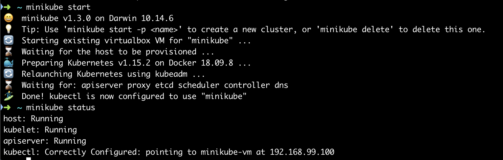

```bash
minikube start --memory='4000mb' --cpus=4  --disk-size='30000mb'
```

musimy chwilę poczekać, aż wstanie nasz klaster. Jeśli używamy virtualbox to możemy sobie podejrzeć co się dzieje w "serwerze":

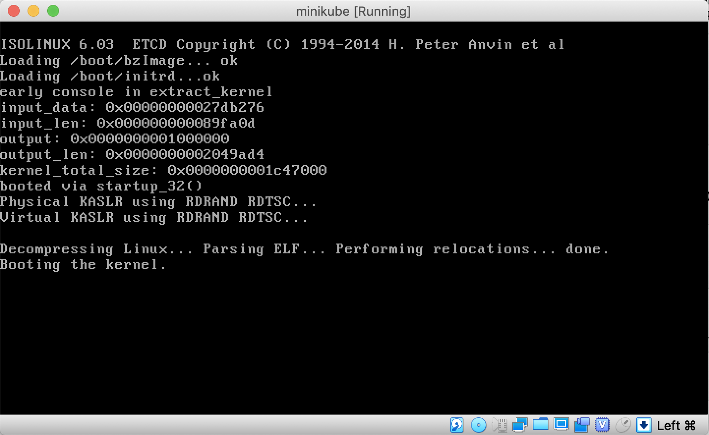

Gdy klaster wpadnie, sprawdzamy połączenie z kubectl do klastra:

```bash
kubectl cluster-info
```

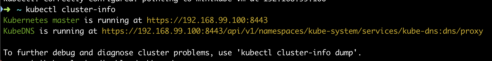

### Kubernetes dashboard

Do Kubernetes dostępny jest dashboard dostępny przez web. Nie nadaje się co prawda zbytnio do zarządzania klastrem, ale potrafi być bardzo pomocny na początku. Nie od razu można zapamietać wszystkie komendy i sztuczki, a zwykle w dashboard da się wymaganą akcje wyklikać.
W przypadku minikube uruchamiamy:

```bash
minikube dashboard
```

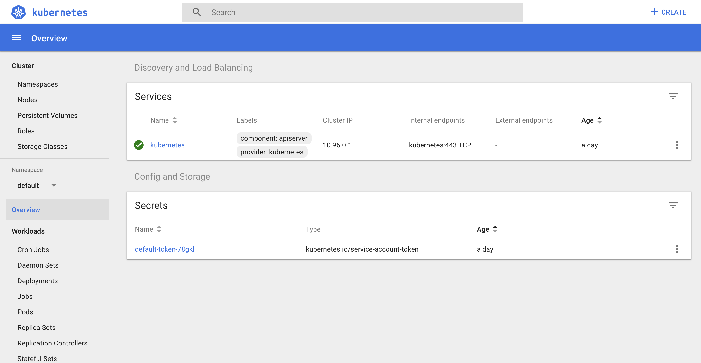

Poza minikube należy uruchomić sobie proxy, które wystawia na lokalnym adresie całe API k8s:

```bash
kubectl proxy
```

W takim wypadku dashboard powinien być dostępny pod adresem `http://localhost:8001/api/v1/namespaces/kubernetes-dashboard/services/https:kubernetes-dashboard:/proxy/` - o ile dashboard jest zainstalowany.

### Ratunku! Minikube nie działa

Na pendrive mam wersję "awaria" bardzo okrojonego k8s, tzw. k3s w postaci obrazu dla VirtualBox - zawiera on najważniejsze części Kubernetes, a dodatki zostały usunięte. Nie ma np. dashboard.


# Podstawy Kubernetes

Zanim zrobimy sobie 5 minut przerwy na nadgonienie i uzupełnienie kawy zerknijmy szybko na nasz klaster:

```bash
kubectl get nodes
```

Poniżej screeny z projektu gdzie jest więcej maszyn niż jedna:
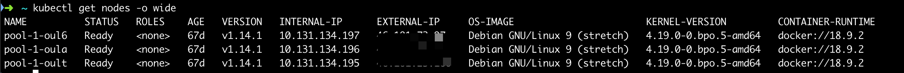

Dla minikube wyglądać to będzie następujaco:
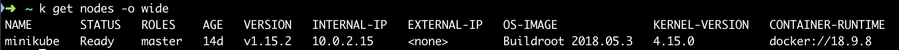

Możemy też poprosić o informacje na temat jednej z maszyn:

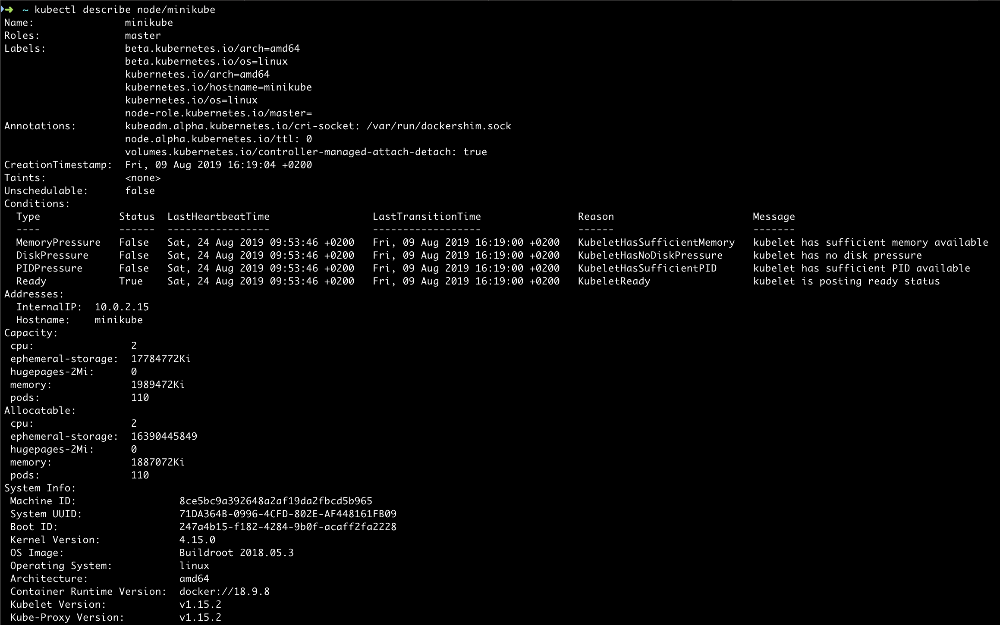

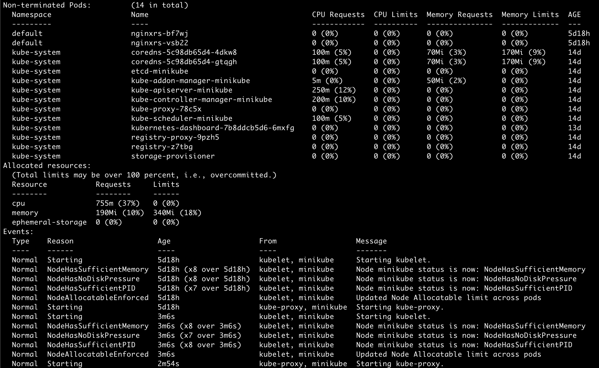

* labels - pozwalają na otagowanie dowolnego obiektu w klastrze parą klucz=> wartość. Na tej podstawie można potem filtrować wyniki, ale też np. w przypadku maszyn wrzucać procesy tylko na te maszyny, które spełniają zadany warunek (operujący na labelach)
* capacity - ile zasobów udostępnia nam dana maszyna
* pods - aplikacje które działają na maszynie, wraz z info o zasobach
* namespace - wszystkie obiekty w klastrze można grupować w ramach namespace - analogicznie jak w językach programowania grupujemy klasy ;)
* events - zdarzenia które są ważne dla danej maszyny, np. spadek wolnej pamięci poniżej alertu, problem z procesem itp.
 


## Przerwa 1 - 5 minut

Kto ma jeszcze problem, może nadgonić, a kto problemu nie ma (oby wszyscy ;)) może uzupełnić kawę lub pobawić się komendami.
 
## Pod

### Co to jest Pod?

* Podstawowy building-block, bez Pod prawie nic się nie odbywa. Każdy proces jaki działa na klastrze działa w ramach Pod
* Jeden lub wiele kontenerów - ściśle połączonych
  * Kontenery na jednej maszynie, współdzielą sieć (jeden IP, widzą się pod nazwą localhost, ta sama przestrzeń portów)
  * Kontenery w jednym podzie współdzielą semafory itp.
  * Mogą współdzielić dysk
  * Kontenery z jednego poda są zawsze uruchamiane na tej samej maszynie
* Efemeryczny

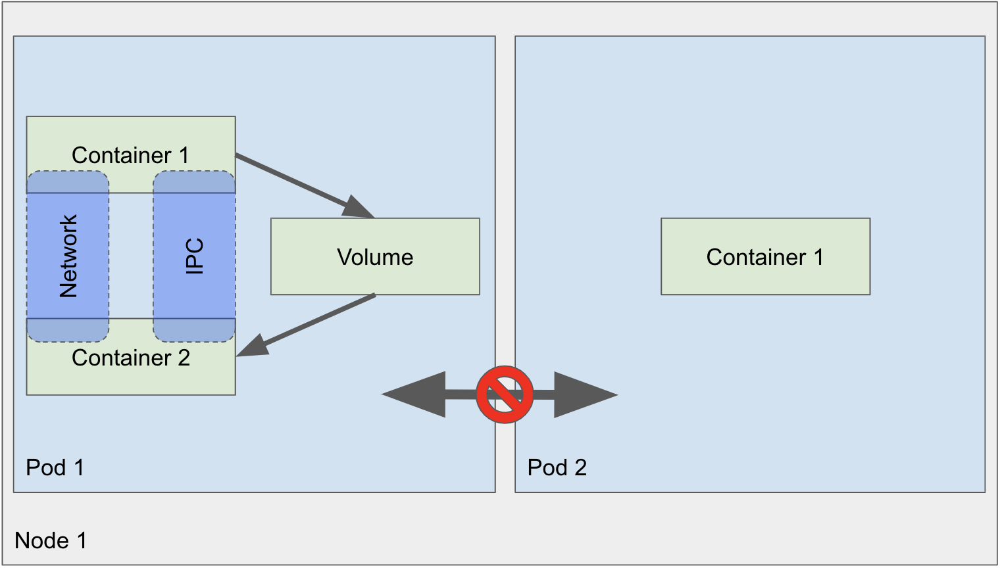


### Tworzenie Pod

Najprostszy Pod w przypadku plików yaml może wyglądać tak:

```yaml
apiVersion: v1 # informacje do parsowania
kind: Pod # typ obiektu
metadata:
  name: nginx # meta obiektu, nazwa 
  labels:
    app: nginx
spec: # specyfikacja
  containers: # jakie kontenery składają się na Pod
  - name: nginx # nazwa kontenera w Pod
    image: nginxdemos/hello:plain-text # obraz docker
    ports:
        - containerPort: 80 # porty, tylko informacyjnie
```

Jeśli chcemy, aby kubernetes dodał taki POD, wystarczy "kazać" mu wdrożyć taki plik:

```bash
kubectl apply -f nginx-pod.yaml
``` 

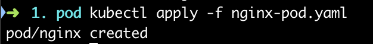

Komenda apply jest idempotenta. Możemy wowołać ją wielokrotnie, ale nie zmieni to stanu klastra. Dopiero zmiana w yaml i ponowne wywołanie apply zmieni stan.

### Praca z Pod

Zobaczmy, czy działa, możemy to zrobić komendą

```bash
kubectl get pods
```

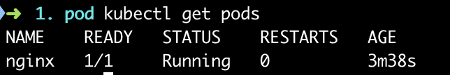

Możemy też poprosić o więcej informacji:

```bash
kubectl get pods -o=wide
```

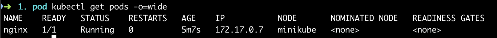

Lub zarządać, aby zmiany pokazywały się na biężąco (tryb --watch, -w):

```bash
kubectl get pods -w
```

Jeśli potrzebne jest więcej informacji, kubectl może wyświetlić szczegóły:

```bash
kubectl describe pod/nginx
```

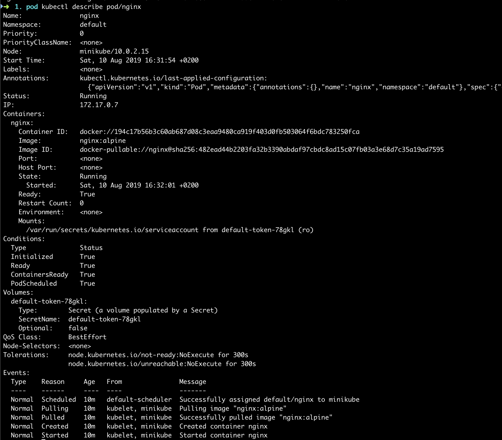

Możemy tu znaleźć informacje o użytym obrazie, IP, stanie, montowanych dyskach i zmiennych środowiskowych, ale też zdarzenia związane z podem, np. informacje o uruchamianiu, albo o problemach z kontenerem.

Jeśli chcemy coś dodatkowo sprawdzić, może spokojnie zalogować się do Pod'a (do dowolnego kontenera w jego wnętrzu):

```bash
kubectl exec -t -i nginx ash
apk add --update curl
curl localhost
```

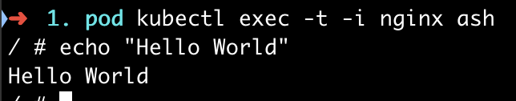

Czasem warto też zajrzeć w logi:

```bash
kubectl logs nginx -f
```

Jeśli nie czujemy się jeszcze pewni w konsoli oraz w kubectl, większość tych akcji możemy wykonać z poziomu dashboard:

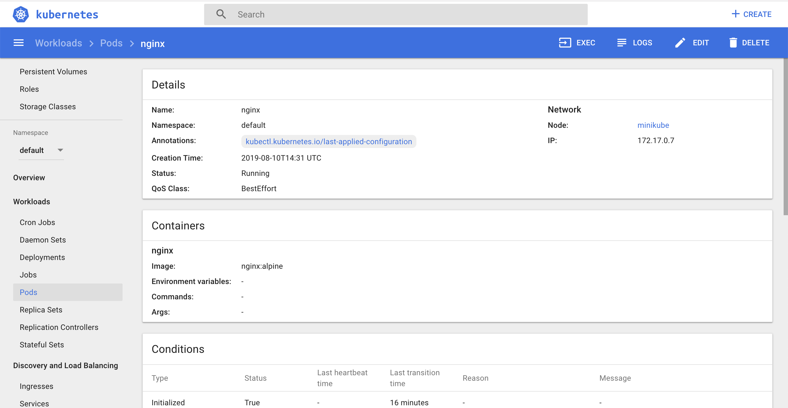

Osobiście sugeruję "przemęczyć" się chwilę z kubectl, ponieważ dashboard nie zawsze jest dostępny, a dodatkowo nie wspiera wszystkich akcji.

### Usuwanie Pod

```bash
kubectl delete pod/nginx
```
Ta komenda najpierw wyśle odpowiedni sygnał i poczeka 30s na zakończenie działania. Jeśli to nie zadziała, to Pod i kontenery w nim zostaną "ubite"

### Inne ciekawe komendy

#### Uruchamianie tymczasowego Pod

Istnieje jeszcze komenda `kubectl run` - nie będę jej poświęcał czasu, ale warto o niej pamiętać. Działa dosyć blisko do `docker run`, zerknijmy sobie szybko na opcje `kubectl run --help`

### Podsumowanie

Znamy już sporo komend pozwalających na zarządzanie i pracę z Podami, ale poza bardzo ułatwionym schedulowaniem procesów na wielu maszynach nie jest to zbytnio przydatne w produkcyjnym użyciu.
Jedną z wad jest to, że tak uruchomiony kontener niekoniecznie wstanie jeśli padnie maszyna.
Z pomocą przychodzi nam ReplicaSet

## ReplicaSet

ReplicaSet pozwala na utrzymanie odpowiedniej liczby Pod danego typu. Pozwala również na zmianę liczby uruchomionych Podów, a więc ułatwia skalowanie.

ReplicaSet zawiera informację o tym jak rozpoznać Pod którym zarządza.

ReplicaSet poza informacjami o tym jak rozpoznać szablon, ma też szablon z którego tworzy nowe Pody jeśli zajdzie taka potrzeba.
W przypadku zaktualizowania żądanej liczby Podów, RS odpowiednio utworzy lub usunie Pody.

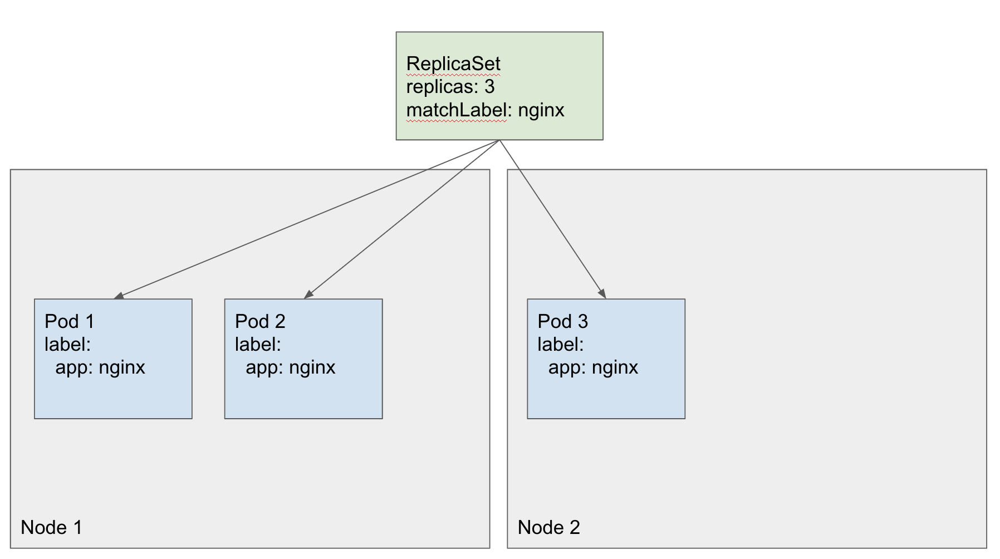 

### Definiowanie ReplicaSet

[nginx-rs.yaml](./2%20replicaset/nginx-rs.yaml)


```yaml
apiVersion: extensions/v1beta1
kind: ReplicaSet
metadata: # metadane ReplicaSet, nazwa, label do łatwiejszego zarządzania
  name: nginxrs
  labels:
    app: nginx
spec: # specyfikacja ReplicaSet
  replicas: 1 # ile Pod chcemy otrzymać
  selector: # w jaki sposób rozpoznawać zarządzane Pody
    matchLabels: 
      app: nginx # UWAGA - to musi być zgodne z tym co jest w template!!!
  template: # szablon dla Pod, dalej ten sam format który mieliśmy bezpośrednio dla Pod'a
    metadata:
      name: nginx
      labels:
        app: nginx # używamy tego label, aby dobrze powiązać z ReplicaSet
    spec:
      containers:
      - name: nginx
        image: nginx:alpine
        ports:
        - containerPort: 80
```

Zaaplikujmy ten plik:

```bash
kubectl apply -f nginx-rs.yaml
```

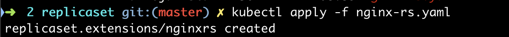

Zobaczmy co się stało w klastrze, tym razem wyświetlimy nie tylko POD ale też inne składowe:

```bash
kubectl get all
```

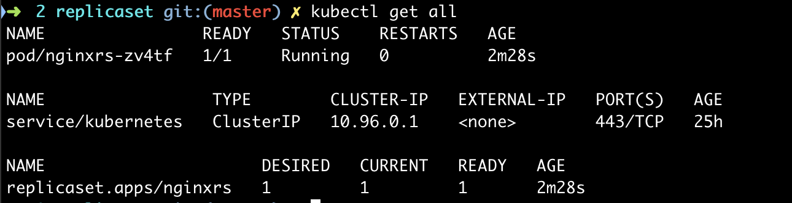

### Skalowanie ReplicaSet

Jedną z zalet ReplicaSet jest możliwość prostego skalowania - po prostu mówimy ile Podów danego typu chcemy mieć, a ReplicaSet się tym zajmuje.

Efekty działań możemy łatwo zweryfikować odpalająć w osobnych oknach podgląd interesujących nas obiektów:

```bash
watch -n1 kubectl get rs
watch -n1 kubectl get pods
```

Następnie możemy skalować nasz RS:

* możemy to zrobić poprzez zmianę pliku i ponowne wykonanie apply
* lub z linii komend:

```bash
kubectl scale --replicas=2 rs/nginxrs
kubectl delete pod/nginxrs-49d7z
kubectl scale --replicas=4 rs/nginxrs
kubectl scale --replicas=0 rs/nginxrs
```

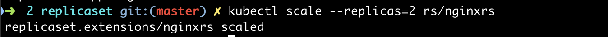

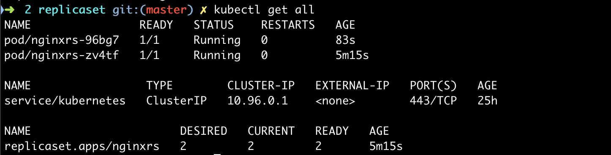

Możesz teraz pobawić się skalowaniem w górę/w dół. (Z umiarem :D)

## Zobaczmy co zrobi ReplicaSet jeśli zaczniemy mieszać w labelach

```bash
kubectl scale --replicas=4 rs/nginxrs
kubectl label pods nginxrs-cxmbj --overwrite app=nginx
kubectl scale --replicas=0 rs/nginxrs
kubectl scale --replicas=2 rs/nginxrs
kubectl delete pod/nginxrs-cxmbj

```

## Port-forward

```bash
kubectl port-forward rs/nginxrs 8080:80
```

To połączy się do jednego z Podów w RS i postawi tunel.

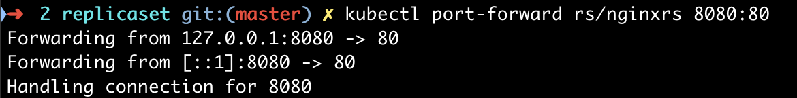

Może nie przyda się do wystawiania portów http/s, ale do połączeń z np. Redis jak znalazł :)

### Usuwanie ReplicaSet

```bash
kubectl delete rs/nginxrs
```

### Podsumowanie

Wiemy już jak skalować i dbać o odpowiednią ilość żyjących instancji naszej aplikacji.
Dosyć szybko, napotkamy jednak problem. Pod w k8s są dosyć dynamiczne, w jednej chwili mogą istnieć, w innej już nie. 
W międzyczasie gdy są restartowane, ich stare IP może być przypisane już gdzie indziej. Jak zatem komunikować się między usługami w różnych Pod?
Np. możemy mieć microservice do skalowania obrazków - w trakcie skalowania, restartu maszyn etc. IP podów będą się zmieniać.

## Service

Service to sposób na udostępnie usługi działającej w ramach wskazanych Pod do innych serwisów lub ew. na zewnatrz klastra. 
Service realizuje dwa podstawowe zadania:
* Service discovery
* Load balancing

### Zasada działania

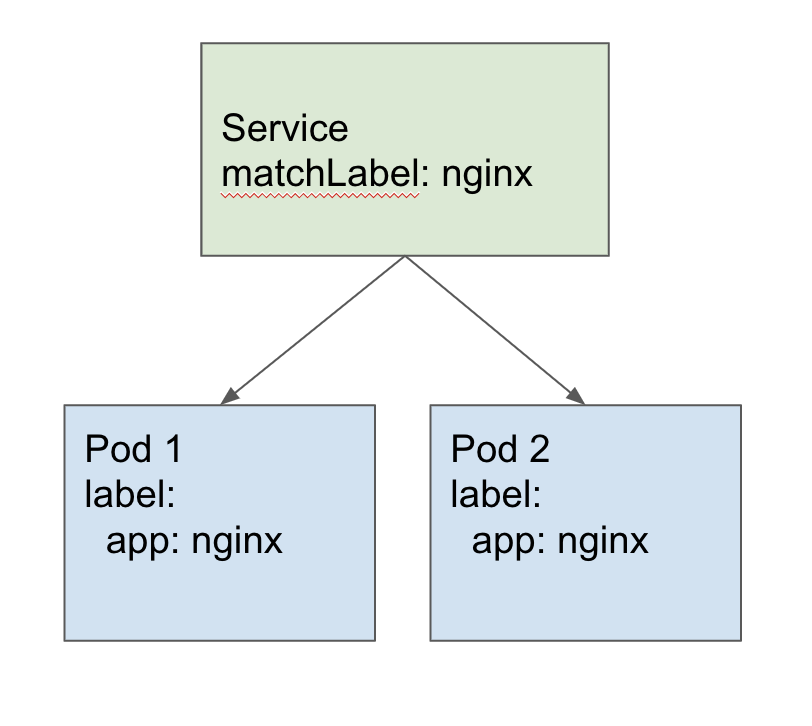

Podobnie jak w przypadku ReplicaSet definiujemy "selektor", po którym service może rozpoznać, które pod realizują usługę, którą service ma udostępniać.

Wchodząc trochę głębiej:
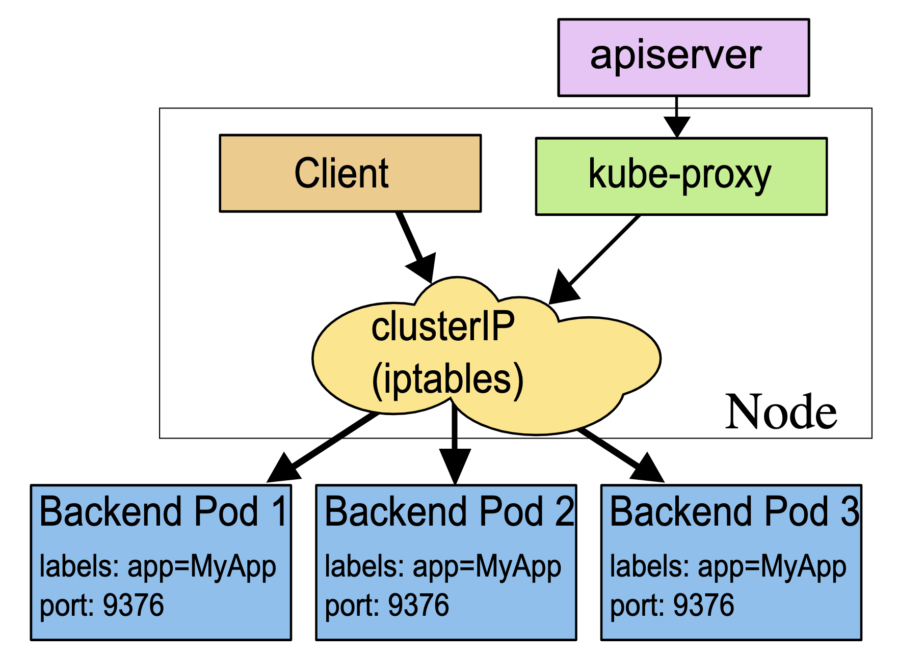

Na obrazku widać jak działa service (w przypadku implementacji opartej o iptables, bo są inne). Stały dla service IP wewnętrzny jest routowany przez iptables do dynamicznie zmieniających się backendów.
Ten stały IP ma dodatkowo przypisaną nazwę w DNS. Dzięki temu nie ma problemu z cache DNS, ponieważ IP nie będzie zmienne - zmienia sie jedynie to gdzie kierowane są nasze requesty.

### Typy Service

* ClusterIp - usługa otrzymuje wewnętrzny IP i nazwę w DNS
* NodePort - usługa otrzymuje port na maszynach (wszystkich) w klastrze, port jest przekierowany na ClusterIp opisany powyżej
* LoadBalancer - bazując na NodePort i ClusterIP wystawia usługę za pomocą LoadBalancera dostarczanego przed cloud providera - np. aws, google etc. *testowałem na GCP i ma to kilka zalet, ale też ma wady
* ExternalName - mapuje service dostępny w klastrze na zewnętrzną domenę, jak wpis CNAME w DNS

### ClusterIP


Zerknijmy sobie na yaml definiujący nasz service:
[./3 service/nginx-svc-clusterip.yaml](./3%20service/nginx-svc-clusterip.yaml)
```yaml
apiVersion: v1
kind: Service
metadata:
  labels:
    app: nginx
  name: nginx-clusterip
spec:
  type: ClusterIP
  selector:
    app: nginx # musi się pokrywać z definicją w Pod
  ports:
  - port: 80
    protocol: TCP
    targetPort: 80 # można pominąć, domylnie = port użyty powyżej, można też użyć nazwy z definicji poda
```

_Otwórz pliki [nginx-rs.yaml](./3%20service/nginx-rs.yaml) i [nginx-svc-clusterip.yaml](./3%20service/nginx-svc-clusterip.yaml) i porównaj krytyczne elementy_

Zaaplikujmy te pliki i zobaczmy co się stanie.

```bash
kubectl apply -f nginx-rs.yaml
kubectl apply -f nginx-svc-clusterip.yaml
```

Powinniśmy mieć teraz nasz service (svc) i ReplicaSet (rs) zdefiniowany
```bash
kubectl get svc,rs # tak - tak można używać skrótów i łączyć typy ;)
```

Odpalmy sobie teraz pod do testów:
```bash
kubectl run -i --rm=true --tty alpine --image=alpine --restart=Never -- ash -il
# czekamy na uruchomienie
apk add curl
# nazwa w yaml to nginx-clusterip
ping nginx-clusterip # x2-4, wyjscie ctrl+c
# nie dziala, ale IP jest widoczne i stale
curl nginx-clusterip #x4-5 razy
```

Zwróc uwagę, że IP jest zawsze to samo dla ping, ale w zwrotce w curl widać, że request poszedł w różne miejsca. 

#### Podsumowanie

ClusterIp to podstawowy typ i jak widać sprawdzi się idealnie do wiekszości zastosowań. Pozwala bezproblemowo komunikować między sobą serwisy. Ogarnia service-discovery i load balancing bez problemów.

### NodePort

Czasami musimy jednak wystawić jakiś port na zewnątrz, może do tego posłużyć NodePort (choć produkcyjnie raczej nie posłuży, ale o tym później).

[./3 service/nginx-svc-nodeport.yaml](./3%20service/nginx-svc-nodeport.yaml)
```yaml
apiVersion: v1
kind: Service
metadata:
  labels:
    app: nginx
  name: nginx-nodeport
spec:
  selector:
    app: nginx
  type: NodePort
  ports:
  - port: 80
    protocol: TCP
    targetPort: 80
    nodePort: 30080 #opcjonalne, inaczej losowy, w obu przypadkach z zakresu 30000-32767
``` 

Plik bliźniaczy do ClusterIp, różni się wpisem type. Parametr nodePort jeśli zostanie pominięty to k8s wylosuje port z zakresu 30000-32767.

```bash
kubectl apply -f nginx-svc-nodeport.yaml
kubectl get svc
minikube ip
```

I wchodzimy na [http://192.168.99.100:30080](http://192.168.99.100:30080)
W przypadku przeglądarki, dosyć niechętnie zmieniało mi maszynę do której leciały requesty, ale świetnie widać to w curl:
```
curl http://192.168.99.100:30080/
```

### ExternalName i LoadBalancer

ExternalName raczej nie jest zbyt przydatny w większości projektów, więc go sobie odpuścimy. W przypadku LoadBalancer nie zadziała on na minikube (zadziała, ale ma tylko trochę wspólnego z tym jak zadziała np w Google Cloud).


### Sprzątanie
Usuńmy wszystko co dodaliśmy zanim przejdziemy dalej.

```bash
kubectl delete rs/nginxrs svc/nginx-clusterip svc/nginx-nodeport
```

Jako ciekawostka:
```bash
kubectl apply -f ./
kubectl delete -f ./
```

też zadziałają ;)

## Ingress

Teraz czas na prawdziwe czary ;) Do tej pory, aby wystawić usługę http/https na zewnątrz musielibyśmy skorzystać z service typu LoadBalancer. 
Takie rozwiązanie nie jest najwygodniejsze, ale można by się z nim zapewne przemęczyć. 

Kubernetes oferuje świetne narzędzie do wystawiania tego typu usług na zewnątrz i jest nim Ingress. Ma bardzo dużo opcji, o czym zaraz się przekonamy ;)

### Czym jest Ingress

* Obsługuje ruch wejściowy http
* Sam Ingress to abstrakcja, ma wiele implementacji
  * Nginx
  * HAProxy
  * Cloud specific
* Umożliwia na dowolne mapowanie domena/katalog na _service_
* Terminuje SSL

### Zanim zaczniemy

Zanim skonfigurujemy Ingress, musimy stworzyć Service, na który będzie kierowany ruch. Service oczywiście potrzebuje też jakieś Pod, na które będzie kierowac ruch.

```bash
kubectl apply -f nginx-rs.yaml
kubectl apply -f nginx-svc-clusterip.yaml
```

Mamy service i replicaset, więc możemy zerknąc na ingress:

```yaml
apiVersion: extensions/v1beta1
kind: Ingress
metadata:
  name: nginx
spec:
  rules:
  - host: nginx.192.168.99.100.nip.io # ta domena po prostu mapuje na ip
    http:
      paths:
      - backend:
          serviceName: nginx-clusterip # musi zgadzać się z name dla service
          servicePort: 80 # jaki port w service za to odpowiada
        path: /
```

Zanim jednak wdrożymy to teraz, musimy w minikube aktywować wsparcie dla ingress:

```bash
minikube addons enable ingress
```

Zerkając w listę pod zobaczymy, że mamy startującą usługę:

```bash
kubectl get pods -n kube-system
```

Ważne info: w przypadku minikube zostanie utworzony dla nas ingress oparty o nginx. Na cloud zwykle można sobie wgrać dowolny ingress, a on przez LoadBalancer wystawia się na świat.
Działa to bardzo sprawnie, ale płaci się za LB zgodnie z cennikiem ;)

Teraz możemy wdrożyć config dla Ingressa.

```bash
kubectl apply -f nginx-ingress.yaml
```

I sprawdzamy czy wszystko działa:

```bash
kubectl get ing
```

Możemy teraz sprawdzić w curl/przeglądarce jak zachowają się adresy:

* [nginx.192.168.99.100.nip.io](http://nginx.192.168.99.100.nip.io) - ten mamy wpisany w configu 
* [fake.192.168.99.100.nip.io](http://fake.192.168.99.100.nip.io) - a tego nie mamy w configu ;)

Możemy dodatkowo wykorzystać annotations, aby przekazać do ingress więcej ustawień konfiguracyjnych. Pełna lista jest dostępna pod adresem [https://kubernetes.github.io/ingress-nginx/user-guide/nginx-configuration/annotations/](https://kubernetes.github.io/ingress-nginx/user-guide/nginx-configuration/annotations/)
Testowo dodajmy mod security wraz z OWASP rules i CORS:

```yaml
apiVersion: extensions/v1beta1
kind: Ingress
metadata:
  name: nginx
  annotations:
    nginx.ingress.kubernetes.io/enable-modsecurity: "true"
    nginx.ingress.kubernetes.io/enable-owasp-core-rules: "true"
    nginx.ingress.kubernetes.io/enable-cors: "true"
spec:
  rules:
  - host: nginx.192.168.99.100.nip.io
    http:
      paths:
      - backend:
          serviceName: nginx-clusterip
          servicePort: 80
        path: /
```

Zobaczmy, jak działają różne paths/hosts, w subkatalogu html dodałem kilka dodatkowych plików. Dodają one podobny ReplicaSet, ale operujący na innym obrazie i innych nazwach/labelach. Do niego analogicznie zmieniony service.

Na koniec dodałem konfigurację ingress:

```yaml
apiVersion: extensions/v1beta1
kind: Ingress
metadata:
  name: nginx-html # inna nazwa, aby nie nadpisać istniejącego
spec:
  rules:
    - host: nginx.192.168.99.100.nip.io
      http:
        paths:
          - backend:
              serviceName: nginx-html # inna nazwa service
              servicePort: 80
            path: /html # zmieniamy ścieżkę

```


W katalogu html odpalmy:
```bash
kubectl apply -f ./ 
kubectl get rs,svc,ing
kubectl describe ing/nginx-html
```

Teraz pod adresem [nginx.192.168.99.100.nip.io](http://nginx.192.168.99.100.nip.io) widzimy naszą starą usługę, a pod adresem [nginx.192.168.99.100.nip.io/html](http://nginx.192.168.99.100.nip.io/html)
widzimy wersję HTML.


* [ ] **Spróbuj zmienić domenę/katalogi i zobacz jak reaguje Ingress na te zmiany.**
* [ ] **Wiesz jak "posprzątać" klaster?**

### Podsumowanie

Zróbmy teraz przerwę 15 minut. Możesz ją wykorzystać na kawę, papierosa, rozprostowanie nóg. Po powrocie zobaczymy co będzie nam potrzebne, aby prosto i przyjemnie wdrażać aktualizacje naszych serwisów.

## Deployment

Deployment pozwala na zarządzanie cyklem życia aplikacji. Podobnie jak ReplicaSet pozwala na utrzymanie odpowiedniej liczby Pod usługi, ale dodatkowo wspiera ich aktualizację.
Dzięki Deployment możemy w bardzo szybkim czasie zaimplementować rolling-update w naszych serwisach (blue-green deployment).

Użycie deployment jest zalecany dla praktycznie każdej usługi, która wymaga stabilnego działania. Ponieważ sam Pod tego nie gwarantuje, a ReplicaSet mocno utrudnia aktualizacje.

### Jak to działa?

Gdy wdrożymy deployment, utworzy on ReplicaSet, którym zarządza.

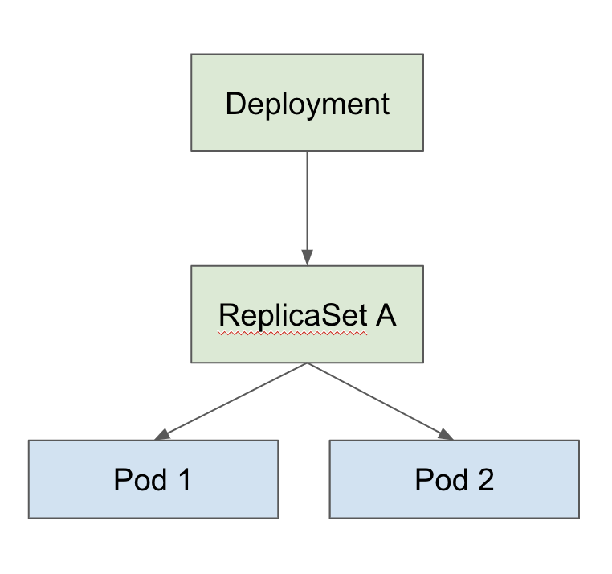

W momencie gdy wdrożony deployment działa z 2 replikami Pod, możemy przez `kubectl apply` przekazać jego nową konfigurację, która np. zawiera nowy obraz Docker.
Deployment utworzy drugi ReplicaSet i zacznie zwiększać jego scalę, zacznie np. od 1.

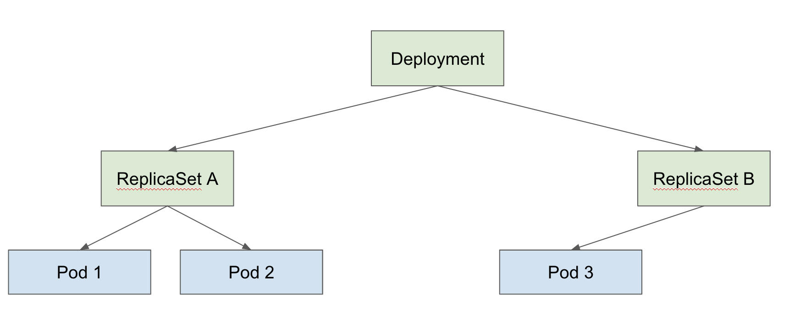


Gdy Pod w nowym ReplicaSet będzie gotowy część ruchu zacznie być na niego kierowana, a Deployment zmniejszy skalę "starego" ReplicaSet.

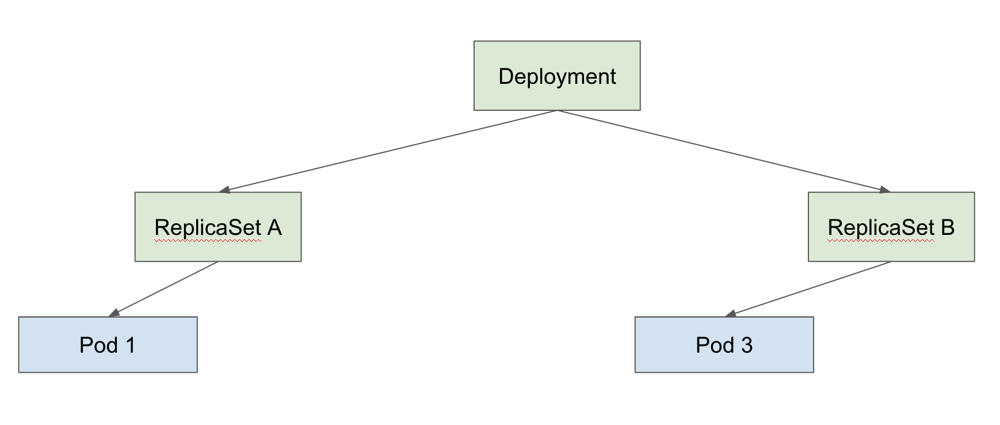

Dalej Deployment bedzie sukcesywnie zmieniał skalę starego i nowego RS:

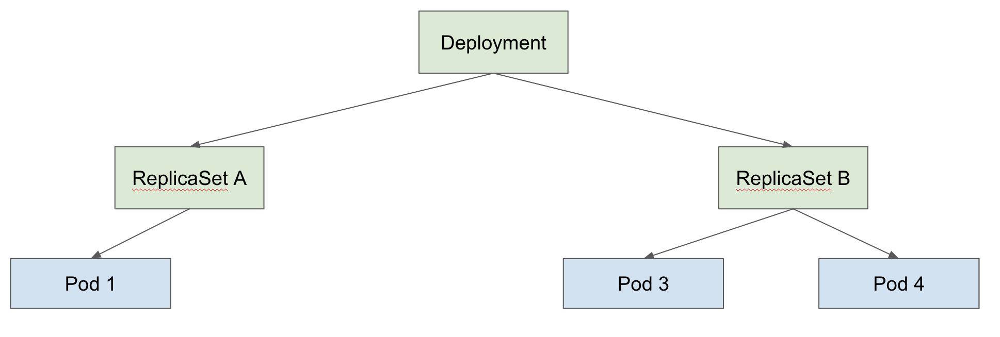

Aż w końcu całość będzie działać w nowej wersji.

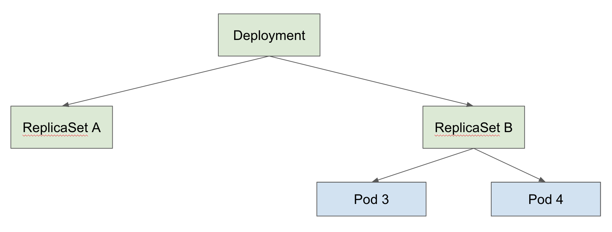

Stary ReplicaSet nie jest usuwany, dzięki czemu możliwy jest rollback.

### Przykład

```yaml
apiVersion: apps/v1
kind: Deployment
metadata:
  name: nginx
  labels:
    app: nginx
spec:
  replicas: 4
  selector:
    matchLabels:
      app: nginx # identycznie jak w RS, musi być zgodny z label.app w Pod
  template:
    metadata:
      name: nginx
      labels:
        app: nginx
    spec:
      containers:
      - name: nginx
        image: nginxdemos/hello:plain-text
        ports:
        - containerPort: 80
        readinessProbe: # nowość - informujemy jak deployment/service mogą się upewnić czy Pod jest działajacy. Istnieje analogiczne livenessProbe. Istnieje też w Pod poza RS czy Deployment
          httpGet:
            path: /
            port: 80
          initialDelaySeconds: 10
          periodSeconds: 5
```

Zaaplikujmy teraz tę konfigurację wraz z odpowiednim ClusterIp oraz Ingress:

```bash
kubectl apply -f ./
```

Sprawdźmy czy działa, zajmie to chwilę, ale pod adresem [nginx.192.168.99.100.nip.io](http://nginx.192.168.99.100.nip.io) powinniśmy ujrzeć naszą stronę.

Żeby zobaczyć jak działa deployment w akcji, zróbmy małe czary. Potrzebne nam będą 4 konsole cli jednocześnie :D

Odpalamy w nich te polecenia (w każdej konsoli jedno polecenie):

```bash
watch -n 1 kubectl get pod
watch -n 1 kubectl get rs
watch -n 1 kubectl get deploy
```

A w czwartej odpalamy sobie polecenie poniżej. Aktualizuje ono obraz (zamiast wywołania kubectl apply możemy wykonać coś takiego), a `--record` powoduje dodanie komendy jako description release.

```bash
kubectl set image deployment/nginx nginx=nginxdemos/hello --record
```

Możemy w dowolnej chwilii podejrzeć sobie historię releasów:

```bash
kubectl rollout history deploy/nginx
```

a jeśli coś poszło nie tak, cofnąć się:

```bash
kubectl rollout undo deployment/nginx --to-revision=1
```


### Sprzątanie

Najprościej, jak zwykle

```bash
kubectl delete -f ./
```

## CronJobs

Poza działającą aplikacja zwykle potrzebne są jeszcze cron'y. Masa ludzi wrzuca je w kontener z aplikacją, ale to bardzo złe rozwiązanie, które w dodatku potrafi się szybko zepsuć przy skalowaniu horyzontalnym ;)

Kubernetes realizuje Cronjoby jeszcze lepiej niż normalny Cron, a służy temu obiekt o nazwie... CronJob ;)

### Konfiguracja

```yaml
apiVersion: batch/v1beta1
kind: CronJob
metadata:
  name: curl
spec:
  schedule: "* * * * *" # ten sam format co cronjob
  concurrencyPolicy: Forbid # domyślnie allow
  successfulJobsHistoryLimit: 3 # domyslna wartosc
  failedJobsHistoryLimit: 1 # domyslna wartosc
  jobTemplate:
    spec:
      template: # template, tak samo jak wcześniej, zawiera informacje o Pod
        spec:
          containers:
            - name: curl
              image: appropriate/curl
              args:
              - -fsSL
              - http://requestbin.net/r/1nhre7g1
          restartPolicy: OnFailure
```

Wrzucamy konfigurację i zobaczmy co się dzieje:

```bash
kubectl apply -f ./
kubectl get pod -w
```

**Pytania**
* Czy kontenery są usuwane od razu? 
* Co widać w logach? 
* Co jeśli podamy błędny adres w curl (symulacja błędu działania)? 
* Jak działa aktualizacja? 
* Co się dzieje gdy naprawimy błędnie skonfigurowany cron?
* Jakie informacje są widoczne w describe?

```
All modifications to a cron job, especially its .spec, are applied only to the following runs.
```

### Czyszczenie ;)

Już chyba wiecie jak?

```bash
kubectl delete -f ./
```

## ConfigMap i Secret

Dotychczas nie zwracaliśmy uwagi na konfigurację naszych kontenerów. Dobre praktyki sugerują używania zmiennych środowiskowych - czyli env. vars i w przypadku Kubernetes, podobnie jak w Docker jest to szeroko przyjęte podejście.

Wracając na chwilę do naszego przykładu z podstawowym Pod, konfiguracja zmiennych środowiskowych wyglądałaby tak:

```yaml
apiVersion: v1
kind: Pod
metadata:
  name: nginx
  labels:
    app: nginx
spec:
  containers:
  - name: nginx
    image: nginxdemos/hello:plain-text
    env: # tu wrzucamy config
    - name: SOME_VARIABLE
      value: value here
```

Takie rozwiązanie ma kilka wad, ale najważniejsze z nich to zaśmiecanie pliku z deploymentem (często zmiennych jest sporo) i trudność w współdzieleniu danych między różnymi konfiguracjami.
Szczególnie w przypadku większych konfiguracji lub środowisk gdzie ustawienia powinny być wspólne w kilku obiektach warto zastosować ConfigMap (my np. używamy dla zagwarantowania wspólnej konfiguracji dla Deployment i CronJob).

### Tworzenie ConfigMap

#### Z linii poleceń

```bash
kubectl create configmap NAZWA ZRODLO
```

Jako źródło możemy podać plik, ale też katalog. Pliki dostępne są potem pod kluczami, gdzie klucz to nazwa pliku, a wartość to jest zawartość.

Jest sporo opcji tworzenia ConfigMap z plików, które z powodu ograniczonego czasu sobie pominiemy, ale jest jedna ciekawa komenda, którą warto znać:

```bash
kubectl create configmap env-file --from-env-file=.env
```

#### Z yaml


```yaml
apiVersion: v1
kind: ConfigMap
metadata:
  name: www-settings
data:
  key: value
```

Dodatkowo, możemy zmienić jedynie `kind`, aby uzyskać trochę bardziej zabezpieczone dane:

```yaml
apiVersion: v1
kind: Secret
metadata:
  name: www-credentials
type: Opaque
data:
  password: dmFsdWU= # base64(value)
```

Następnie możemy użyć danych w konfiguracji Pod:

```yaml
apiVersion: v1
kind: Pod
metadata:
  name: nginx
  labels:
    app: nginx
spec:
  containers:
  - name: nginx
    image: nginxdemos/hello:plain-text
    envFrom: # wczytanie ConfigMap hurtowo
      - configMapRef:
        name: www-settings
    env:
    - name: VARIABLE_NAME # wczytanie jednej env variable z Secret
      valueFrom:
        configMapKeyRef: # uwaga, Secret!
          name: www-credentials
          key: password
```

Opcji jest wiele, a temat dosyć prosty, więc przejdźmy może do konkretnego użycia. 

### Przykład: Env vars w ConfigMap

```yaml
apiVersion: v1
data:
  greeting: "Hello World"
kind: ConfigMap
metadata:
  name: greeting
```

Użycie w deployment:

```yaml
apiVersion: apps/v1
kind: Deployment
metadata:
  name: nginx
  labels:
    app: nginx
spec:
  replicas: 4
  selector:
    matchLabels:
      app: nginx
  template:
    metadata:
      name: nginx
      labels:
        app: nginx
    spec:
      containers:
      - name: nginx
        image: inanimate/echo-server
        ports:
        - containerPort: 8080
        readinessProbe:
          httpGet:
            path: /
            port: 8080
          initialDelaySeconds: 10
          periodSeconds: 5
        env:
        - name: GREETING # wczytanie jednej env variable z Secret
          valueFrom:
            configMapKeyRef:
              name: greeting
              key: greeting
```

Service oraz Ingress bez większych zmian jak poprzednio, jedynie port w Service trzeba dostosować.


**Czy jeśli zmienię configMap, to deployment automatycznie wczyta zmiany?**

```bash
kubectl rollout restart deploy/nginx
```

### Przykład: Basic Auth w Ingress
Bardzo często potrzebne jest zabezpieczenie strony, głównie testowej, przez basic auth. 

Operujemy na Ingress Nginx, który jest praktycznie w pełni konfigurowalny i ma świetną dokumentację. Nas interesuje głównie dokument [https://github.com/kubernetes/ingress-nginx/tree/master/docs/examples/auth/basic](https://github.com/kubernetes/ingress-nginx/tree/master/docs/examples/auth/basic).

Wygenerowałem sobie wpis httpasswd dla pary kubernetes:kubernetes `kubernetes:$apr1$iB20Sk8p$ZSJYXAJRVvAFrJVihsiJs.`
Wersja zakodowana w base64 wygląda tak: `a3ViZXJuZXRlczokYXByMSRpQjIwU2s4cCRaU0pZWEFKUlZ2QUZySlZpaHNpSnMu`

Na podstawie tych danych, utworzyłem sobie Secret:

```yaml
apiVersion: v1
data:
  auth: a3ViZXJuZXRlczokYXByMSRpQjIwU2s4cCRaU0pZWEFKUlZ2QUZySlZpaHNpSnMu
kind: Secret
metadata:
  name: basic-auth
type: Opaque
```

Następnie danych tych mogę użyć w konfiguracji Ingress, zgodnie z dokumentacją:

```yaml
apiVersion: extensions/v1beta1
kind: Ingress
metadata:
  name: nginx-html
  annotations:
    # typ uwierzytelniania
    nginx.ingress.kubernetes.io/auth-type: basic
    # nazwa Secret gdzie trzymamy dane do logowania
    nginx.ingress.kubernetes.io/auth-secret: basic-auth
    # info do wyświetlenia
    nginx.ingress.kubernetes.io/auth-realm: 'Authentication Required - foo'
spec:
  rules:
  - host: nginx.192.168.99.100.nip.io
    http:
      paths:
      - backend:
          serviceName: nginx-clusterip
          servicePort: 80
        path: /
```

Standardowo już

```bash
kubectl apply -f ./
```

I voila!

## Namespace

Ten temat pozwolę sobie odpuścić, ale wszystkie nasze obiekty możemy wdrażać w różnych namespace.

Namespace pozwala podzielić klaster na różne aplikacje, albo np. na instancje test, prod, beta etc. Obiekty w ramach jednego namespace nie są widoczne dla obiektów z drugiego namespace (* nie do konca).
W ramach namespace można nadać różne uprawnienia dla użytkowników, jak i ustalać limity - pamięci, procesora, podów.

## SSL

To chyba najfajniesze co ostatnio znalazłem jeśli chodzi o Kubernetes. Istnieje project `cert-manager` który pozwala na dynamiczne uzyskiwanie i odświeżanie certyfikatów SSL, pozyskiwanych m.in. z Let's Encrypt.

Jest jeden minus, Let's Encrypt nie wyda nam SSL na IP prywatny, więc w ramach tego warsztatu musimy temat przeskoczyć :/

* https://github.com/jetstack/cert-manager
* https://www.digitalocean.com/community/tutorials/how-to-set-up-an-nginx-ingress-with-cert-manager-on-digitalocean-kubernetes

## Helm

Powoli mamy komplet informacji. Jest dużo więcej obiektów, ale jak się można domyślić, trzeba utworzyć sporo obiektów i mieć sporo wiedzy aby odpalić jakąś bardziej zaawansowaną aplikację, w której skład wchodzi np. MySQL, Elastic i Redis oraz RabbitMQ.

Z pomocą przychodzi nam manager paczek dla Kubernetes, czyli Helm.

Paczki dla Helm można przeglądać w [Helm Hub](https://hub.helm.sh/) lub w repozytorium GitHub [https://github.com/helm/charts](https://github.com/helm/charts).

### Jak działa Helm?

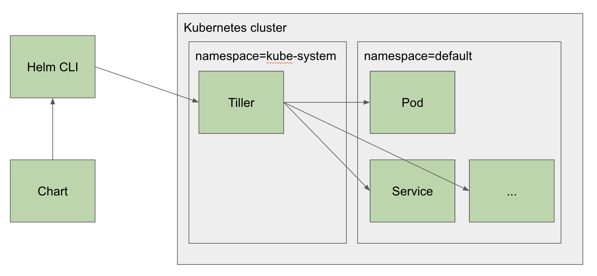

Zajrzyjmy jeszcze w pliki, np. tutaj: [https://github.com/helm/charts/tree/master/stable/dokuwiki](https://github.com/helm/charts/tree/master/stable/dokuwiki)

### Instalacja

https://github.com/helm/helm#install

### Pierwsze wdrożenie

#### Set-up klastra

```bash
helm init --history-max 200
kubectl get pod -n kube-system -w
```

Chciałbym uruchomić wiki w postaci [Dokuwiki](https://github.com/helm/charts/tree/master/stable/dokuwiki) - ponieważ jest proste, a na razie im prostsze tym lepiej dla nas ;)

```bash
helm install stable/bookstack
kubectl port-forward svc/NAZWA-SERVICE 8080:80
```

Musimy chwilę poczekać aż wstanie.

Zobaczmy co wstało

```bash
kubectl get pod,svc,pvc
kubectl get 
```

A teraz zróbmy to porządnie ;)

```bash
helm list
helm delete --purge NAZWA
helm install --name bookstack --values values.yaml stable/bookstack
kubectl get pod -w
```

I zerkamy na stronę [bookstack.192.168.99.100.nip.io](bookstack.192.168.99.100.nip.io)  
Można się zalogować za pomocą admin@admin.com : password

## PersistentVolume i PersistentVolumeClaim

Praktycznie w każdym "poważnym" projekcie potrzebna jest warstwa zapisu na dysk, do bazy etc. W Kubernetes zasoby dyskowe dostarczane są w podobnej postaci jak volumes w Docker, ale jest to bardziej rozbudowane.

Zacznijmy od podstaw. 

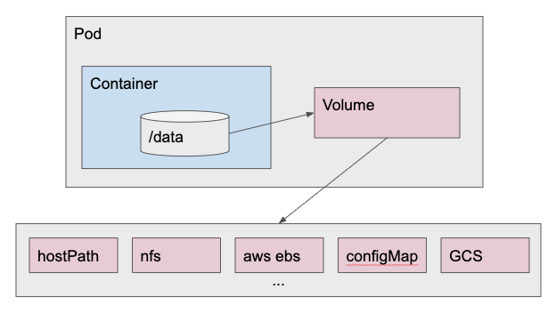

### Host

```yaml
apiVersion: v1
kind: Pod
metadata:
  name: nginx
  labels:
    app: nginx
spec:
  containers:
    - name: nginx
      image: nginxdemos/hello:plain-text
      volumeMounts: # montujemy wolumeny
      - mountPath: /data # sciezka w Pod
        name: data # nazwa Volume
  volumes: # definicje volume
    - name: data # nazwa
      hostPath: # driver
        path: /volumes/data1 # opcje drivera, tu sciezka na maszynie
```

```bash
kubectl apply -f pod-host.yaml
kubectl exec -t -i nginx ash
cd /data
touch test
ls -al
```
Możemy zapisywać spokojnie na takim volumenie, zobaczmy co się stanie gdy go usuniemy:

```bash
kubectl delete -f pod-host.yaml
kubectl apply -f pod-host.yaml
kubectl exec -t -i nginx ash
cd /data
ls -al
```

Plik nadal istnieje, ale w praktyce nie jest tak różowo - jeśli Pod trafi na inny Node to tego pliku już tam nie będzie.

Powyższe podejście ma jeszcze jeden minus. Może okazać się, że po usunięciu Pod znika volume, w przypadku hostPath tego nie widać i przy innym providerze może on zniknąć.

### PersistenVolume

Volume można utworzyć osobno, poprzez PersistentVolume oraz PersistentVolumeClaim i wtedy ich życie nie jest uzależnione od Pod.
Nie są dzielone na namespace.

```yaml
kind: PersistentVolumeClaim
apiVersion: v1
metadata:
  name: pvc-host
  labels:
    type: host
spec:
  storageClassName: "local" # nazwa typu, definiujemy sami
  accessModes:
    - ReadWriteOnce
  resources:
    requests:
      storage: 1Gi # ile chcemy miejsca
``` 

Zobaczmy co się stanie jeśli zaaplikujemy taki config:

```bash
kubectl apply -f pvc-host.yaml
kubectl get pvc
kubectl describe pvc-host
kubectl get storageclass
```

Nie startuje, bo nie wie jak utworzyć taki volume z tym typem StorageClass.

Musimy mu z tym pomóc i zdefiniować volume, który spełni te wymagania:

```yaml

---
apiVersion: v1
kind: PersistentVolume
metadata:
  name: host1
spec:
  storageClassName: "local"
  capacity:
    storage: 2Gi
  accessModes:
    - ReadWriteOnce
  hostPath:
    path: "/volumes/vol1"
---
apiVersion: v1
kind: PersistentVolume
metadata:
  name: host2
spec:
  storageClassName: "local"
  capacity:
    storage: 3Gi
  accessModes:
    - ReadWriteOnce
  hostPath:
    path: "/volumes/vol2"
```

```bash
kubectl apply -f pv-host.yaml
kubectl get pvc,pv
```

I finalnie możemy robić Pod (wcześniej by oczekiwał na volume).

```bash
kubectl apply -f pod-pv.yaml
```


I sprzątamy... ;)

### PerstitentVolumeClaim bez PersistentVolume

Niektóre drivery dla PVC mają pewną zaletę nad innymi - mianowicie potrafią same tworzyć PersistentVolume gdy jest on potrzebny.
Zobaczmy jak to działa na przykładzie NFS (identycznie będzie działać na praktycznie każdym cloud provider).

Najpierw zacznijmy do serwera nfs ;) Z pomocą przychodzi Helm, który dodatkowo poza samym serwerem konfiguruje odpowiednio StorageClass, dzięki czemu tworzenie volume odbywa się automatycznie.

```bash
helm install stable/nfs-server-provisioner --name nfs
kubectl get pod -w
```

```bash
kubectl get pvc,pv # powinno być pusto
kubectl apply -f pvc-nfs.yaml
kubectl get pvc,pv
kubectl describe pvc/pvc-nfs
kubectl apply -f pod-host.yaml
```

Jak sprawdzić czy volume działa? (exec, potem delete, apply, exec)

### StorageClass

Czasami musimy stworzyć własny StorageClass, aby móc go używać, na ten moment sobie przeskoczymy część praktyczną, ale przyda się garść informacji:

#### Cloud storage

W przypadku cloud zwykle własny StorageClass jest potrzebny do zdefiniowania parametrów usługi:

```yaml
apiVersion: storage.k8s.io/v1
kind: StorageClass
metadata:
  name: slow
provisioner: kubernetes.io/gce-pd
parameters:
  type: pd-standard
  replication-type: none
```

#### Zewnętrzne API

```yaml
apiVersion: storage.k8s.io/v1
kind: StorageClass
metadata:
  name: slow
provisioner: kubernetes.io/glusterfs
parameters:
  resturl: "http://127.0.0.1:8081"
  clusterid: "630372ccdc720a92c681fb928f27b53f"
  restauthenabled: "true"
  restuser: "admin"
  secretNamespace: "default"
  secretName: "heketi-secret"
  gidMin: "40000"
  gidMax: "50000"
  volumetype: "replicate:3"
```

#### Dostępne StorageClass

Dobra dokumentacja jest dostępna pod adresem: [https://kubernetes.io/docs/concepts/storage/storage-classes/](https://kubernetes.io/docs/concepts/storage/storage-classes/)


### ConfigMap

Możemy też podlinkować ConfigMap, to świetna opcja jeśli np. chcemy współdzielić plik parameters.yaml lub klucze JWT. Pliki zapisane w ConfigMap są widoczne jako normalne pliki na dysku, ale są tylko do odczytu


### GlusterFS
Korzystaliśmy teraz z NFS, ale w trakcie testów wypadł on dosyć niestabilnie. Przy większym ruchu na minikube potrafił się wywalić. Minikube ma wbudowany GlusterFS, który wymaga odrobinę zasobów, ale działa zdecydowanie szybciej niż NFS.

Można go uruchomić jako add-on:

```bash
minikube addons enable storage-provisioner-gluster
```

Potem sprawdzamy czy działa:
```
kubectl get pod -n storage-gluster -w
```

Możemy używać już storageclass `glsuterfile` co pozwoli na volumeny szybsze, lepiej nadające się pod katalogi z większym ruchem.


## Praktyka
Spróbujmy teraz odpalić coś konkretnego w Kubernetes. Niestety nie znalazłem żadnego popularnego projektu opartego o Symfony, a posiadającego dobry config pod Kubernetes. 

Mam trzy propozycje:
* Sylius (trudniej)
* Mautic (łatwiej)
* Inny projekt Waszego polecenia?

Chciałbym pokazać też fragmenty takie jak baza danych, storage etc.

## Inne - o czym pamiętąć
* Logi
* Monitoring
* Sesje
* Filesystem
* Budowa kontenera i *entrypoint*
* ReadinessProbe, LivenessProbe

## Ciekawe linki
https://kubemap.dev/map/


---- 
# Śmietnik

## Własny projekt

**To olewamy**

Dobra, to "zepnijmy" sobie wszystko w całość.

```bash
composer create-project symfony/website-skeleton todo
cd todo
docker build --no-cache -t kubernetes_todo .
docker run --rm --name todo -p 8080:80 kubernetes_todo
```


## Sylius

Wbijamy do mysql i pracujemy zgodnie z poleceniami.

```bash
kubectl exec -t -i mysql-555cb9c794-5fsgb bash 
mysql -u sylius -p sylius
```


